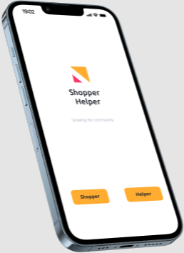
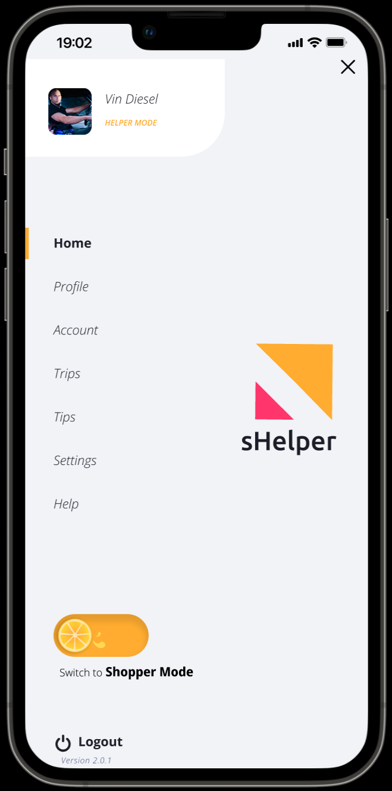
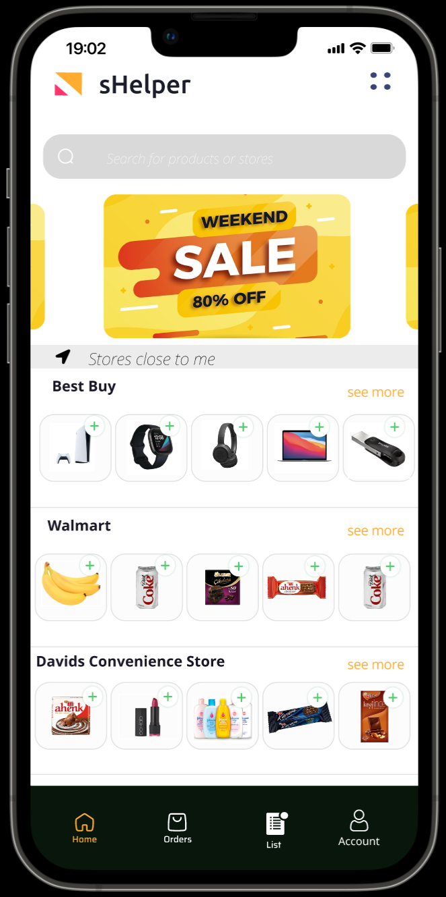
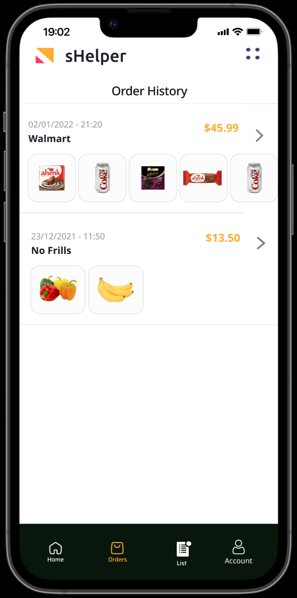
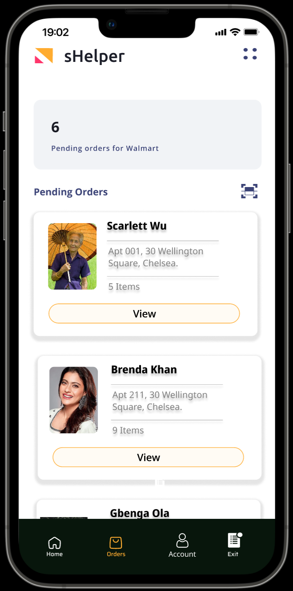

# Shopper Helper

A Figma prototype for a community shopping application with free delivery on all grocery/item orders made within a specific location’s radius. The purpose of this application is to reduce the spread of COVID-19 by promoting members of same the community to buy items for each other.

When a member offers to deliver another member's order for them we call them a `Helper`. These Helpers can deliver up `4` community members order while doing their personal shopping, hence reducing the number of people physically grocery shopping in stores.

Presentation Link: https://studio.youtube.com/video/gVSAedX6AiY/edit

Prototype Link: https://www.figma.com/proto/9flWFEsQhDLdDEOtvjyL6S/Shopper-Helper-iPhone-App?node-id=90%3A1984&scaling=scale-down&page-id=0%3A1&starting-point-node-id=44%3A828

| Shopper Helper    |
| :------------: |
|  |

## Application Features

### Toggle View

Shopper Helper allows its users to toggle between being a `Shopper` (needing help with shopping) and a `Helper` (helping those in need). 
Once the app is launched, the user is required to pick a role on the app which then leads to the home page.

| Shopper Mode    | Helper Mode   |
| :------------: | :----------: |
|  |  |

### Shopper Mode

As a `Shopper` the user gets free delivery on all items they buy due to the kindness of their fellow helping members in their neighborhood! 

A `Shopper` can pick a variety of items from different stores around them and their `neighbors` could help them to deliver those items if they also happen to be going to that store. When a `Shopper` creates a shopping list, the Helpers in the `community` going to that that location get notified and can decide whether they are able to help deliver these items.

| Shopper Home Screen    | Helper  Home Screen   |
| :------------: | :----------: |
|  |  |

### Helper Mode

As a `Helper` the user is considered a `super-hero` in their community! This incredible individual has taken it upon themselves to assist neighbours who need help delivering their orders free of charge.

A `Helper` can decide which Shopper to help based on the `Helper's` transportation mode, store location, convenience and several other factors -- based on the `Helper's` discretion. As soon as a `Helper` picks the store location they are going to, the `Helper` receives a list of Shoppers who need assistance delivering their ordered items. The `Helper` chooses from the list whichever orders they can help with.

| Shopper Order History    | Helper Pending Orders   |
| :------------: | :----------: |
|  |  |

### Transfer Of Funds

Shoppers are only charged when there is a `Helper` who has agreed to deliver the order made. The `Helper` receives the funds to buy the order at the store location when they agree to deliver an order.

To prevent fraudulent behaviour the maximum dollar amount of orders that can be agreed to by the `Helper` per day is `$2500`. In a situation where a delivery was not made by the `Helper`, a dispute is filed with the payment service provider to request a refund and the `Helper's` account is suspended until the dispute has been resolved. 

Shoppers are encouraged to tip their Helpers after a successful delivery.

## Contributors

### Vision-Yard Tech
Team number - 41

| Member    | Contribution   |
| :------------: | :----------: |
| Oreoluwa Ogunlude | Application report  |
| Isaac Ebhodaghe | Application responsivness |
| Tobi Ogbaran | Application research  | 
| Anjola Adeyemi | Application experience |

